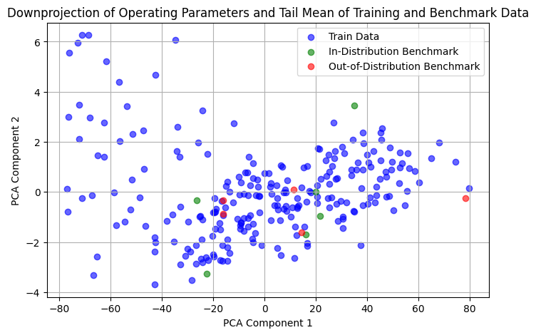

# Master Thesis Progress Report

Severin Bergsmann, 23.01.2026

Proposed Rerearch Questions for Master Thesis:
- **RQ1**: How well do time-series forecasting foundation models perform zero-shot prediction of turbulent heat flux time series from gyrokinetic simulations?

For RQ2 I am not sure concerning the right one.
- **RQ2**: Does fine-tuning time-series foundation models on gyrokinetic flux data, with explicit conditioning on physical operating parameters, lead to improved forecasting accuracy and stability compared to zero-shot predictions?
- **RQ2**: To what extent does conditioning on physical operating parameters improve the forecasting accuracy and stability of fine-tuned time-series foundation models for gyrokinetic flux prediction, compared to fine-tuning without parameter conditioning?

## Zero-Shot Benchmarking

This section presents the zero-shot performance evaluation of various pre-trained time series forecasting models on the flux timeseries. The models were evaluated without any fine-tuning to assess their generalization capabilities.

### Benchmark Results

The following table summarizes the performance of different models on in-distribution and out-of-distribution test sets:

| Model                               | In-Distribution RMSE | In-Distribution SE | Out-of-Distribution RMSE | Out-of-Distribution SE |
| ----------------------------------- | -------------------- | ------------------ | ------------------------ | ---------------------- |
| **NX-AI/TiRex**                     | 79.49                | 14.38              | 64.04                    | 19.53                  |
| **amazon/chronos-bolt-tiny**        | 110.15               | 14.08              | 92.89                    | 21.16                  |
| **amazon/chronos-2**                | 107.09               | 15.74              | 87.47                    | 22.08                  |
| **google/timesfm-2.5-200m-pytorch** | 104.23               | 14.87              | 87.20                    | 25.05                  |
| **google/timesfm-2.0-500m-pytorch** | 156.17               | 67.31              | 98.61                    | 23.55                  |

### Hyperparameters

All models were evaluated using consistent hyperparameters to ensure fair comparison. The evaluation utilized a prediction length of 64 time steps across all models. For calculation of rmse and standard error the provided formula was used. I downsampled the original timeseries from 800 timesteps with a factor of three, leading to timeseries of length 267. For the required means of forecasts and targets, the last 80 timestamps were averaged.

### Key Observations

- **Best Overall Performance**: NX-AI/TiRex achieved the lowest RMSE on both in-distribution (79.49) and out-of-distribution (64.04) datasets, demonstrating superior generalization capabilities.

## Finetuning

### Data Preprocessing

The full dataset consists of 300 timeseries with a total of 800 timesteps each. Since we are interested in timeseries with a linear growth phase, an overshoot point and a irregular oscillation around a certain mean, we filter out all timeseries whose head and tail mean is below 1.0. For I used the first and last 240 timesteps. To match with the given evaluation data, I downsample each timeseries with a sampling factor of 3 leading to timeseries with 267 timesteps.
After removing the six in-distribution benchmark timeseries with indexes [8, 115, 131, 148, 235, 262], we are left with 245 timeseries for training. Each timeseries has a set of operating parameters, s_hat, q, rln and rlt which are used for conditioning during training and evaluation.

#### Out-of-Distribution training data
During data preprocessing some samples appeared to be out of distribution with respect to the benchmark data. The downprojection shown in the figure below downprojected the four operating parameters and the respective tail mean for all training and benchmark timeseries. I collected all indices of training data points that are outside of the clustered region that incporporates all benchmark data.



### Data Augmentation
I adapt various data augmentation methods to extend the number of training samples for better performance.

#### Windowed sub-sampling
During sub-sampling I only use each third timestep of the original series. This leads to two-thirds of the data not being used. Additionally sub-sampling the original timeseries using a window of 1 I have three time-series, effectively tripeling my training dataset.

#### Noise
During training I apply two types of random noise to the timeseries, cumulated noise and simple random noise. Both are sampled from a normal distribution with mean 0.0 and standard deviation 1e-4.

#### Stratified sampling
Since my goal is to predict the mean over the last 80 timesteps as closely as possible, I apply a stratified sampling during training by assigning each timeseries to a bin according to the mean of the last 80 timesteps. During sampling in the data loader, I iterate over each bin and randomly choose a timeseries from this bin.

#### Random cutting
During training each timeseries is cut at an index: ``cutoff_idx \in [pred_len: len(timeseries) - pred_len + 1]``. The model receives the following context and target:

````
context = timeseries[:cutoff_idx]
target = timeseries[cutoff_idx : cutoff_idx + pred_len]
````

The context is padded according to the model specifications and a context_mask is returned indicating padded timestamps.


### Experiments

For training I split the training dataset in a stratified manner into training and validation set with a size of 10% of the training data.

- **Tail Mean based Stratification**: The training data is split into training and validation sets according to the means of the timeseries tails. For this I use the last 80 timesteps of the sub-sampled timeseries to match the evaluation standard.
- **PCA-KMeans Operating Parameter Stratification**: For training models with operating parameter conditioning, I use a second training and validation set splitting by clustering the timeseries in the downprojected operating parameter space.


I used ``amazon/chronos-2`` and ``google-research/timesfm`` for finetuning. The table below shows all benchmark results for all relevant finetuning runs.

#### Finetuning Results

The following tables present the best performing fine-tuned models for Chronos-2 and TimesFM. A total of 36 finetuning runs were conducted (30 for Chronos-2, 6 for TimesFM) exploring various approaches including standard LoRA finetuning, full finetuning, and LoRA with global operating parameter conditioning (OPC) using Feature-wise Linear Modulation (FiLM) layers.

##### Top Chronos-2 Fine-tuned Models

| Run Name               | Training Type | In-Dist RMSE | In-Dist SE | Out-of-Dist RMSE | Out-of-Dist SE | init. LR | Train Steps | Key Features                        |
| ---------------------- | ------------- | ------------ | ---------- | ---------------- | -------------- | -------- | ----------- | ----------------------------------- |
| **Chronos2-LoRA**      | LoRA          | **20.91**    | 4.84       | 13.96            | 3.72           | 1e-3     | 3.000       | LoRA                                |
| **Chronos2-LoRA-FiLM** | LoRA + FiLM   | 22.34        | 9.10       | **7.66**         | 2.29           | 1e-3     | 10.000      | Lora, BasicFiLM, ZScoreNorm         |
| **Chronos2-LoRA-FiLM** | LoRA + FiLM   | 21.40        | 6.92       | 10.80            | 1.78           | 1e-3     | 10.000      | LoRA, BasicFiLM, ZScoreNorm         |
| **Chronos2-LoRA**      | LoRA          | 21.99        | 6.43       | 13.63            | 3.31           | 1e-3     | 3.000       | LoRA                                |
| **Chronos2-LoRA-FiLM** | LoRA + FiLM   | 25.64        | 9.08       | 10.07            | 2.77           | 1e-3     | 5.000       | LoRA, BasicFiLM, ZScoreNorm         |
| **Chronos2-LoRA-FiLM** | LoRA + FiLM   | 24.67        | 7.86       | 10.54            | 2.67           | 1e-4     | 3.000       | LoRA, DropOOD, ContEmbed, LayerFilm |

All runs used a linear learning rate schedule with no warmup steps, a batch size of 128 and 1 gradient accumulation step. AdamW_fused was chosen as Optimizer. The prediction length was set to 80 which is a valid choice since it allowed to predict the required timestamps for the forecast mean in one go during autoregressive rollout in evaluation. Furthermore, no target padding was necessary inside the model since the patch size of Chronos2 is 16 which is a multiple of 80.

###### Key Features
- **LoRA**: for Chronos2 a lora config with r=8, lora_alpha=16 was used. LoRA Matrices were put on query, key, value, and output projections in multi-head attention modules and on the output patch embedding layer.
- **BasicFiLM**: This FiLM Module linearly embeds the z-score normalized operating parameters into a 128-dim space, applies a ReLU activation and then produces gamma (scale) and beta (shift) representations using two distinct linear heads mapping from 128 -> hidden_dim of Chronos2 (768). The linear modulations is applied as follows: ``x * (gamma + 1.0) + beta``. BasicFilm was applied on the hidden states before the encoder stack.
- **ZScoreNorm**: Operating Parameters were normalized on the training set to mean 0 and std 1. The min and max ranges per operating parameter were manually set based on the rounded min and max values off all parameters:
    ````
    {
        "shat": (0, 5),
        "q": (1, 9),
        "rlt": (3.5, 12),
        "rln": (0, 7),
    }
    ````
- **LayerFiLM**: In contrast to BasicFiLM, LayerFilm uses the same FiLM modules as in ``ml-jku/neural-gyrokinetics/gyroswin``. One linear layer maps from the model's hidden dim to 2 * hidden dim and chunks the output vector into two equally sized representations for scale and shift. Those are similarly applied to the hidden states as BasicFilm.
- **DropOOD**: As described in sub-section _Out-of-Distribution training data_ 42 timeseries that do not closely resemble the benchmark data in down-projected space are dropped from the 245 training timeseries.
- **ContEmbed**: The ``ContinuousConditionEmbed`` module from ``ml-jku/neural-gyrokinetics/gyroswin`` is applied (and replaced ZScoreNorm) to the un-normalized operating parameters to produce a sin-cos embedding which serves as input for the LayerFiLM module forward method.


##### Top TimesFM Fine-tuned Models

| Run Name              | Training Type   | In-Dist RMSE | In-Dist SE | Out-of-Dist RMSE | Out-of-Dist SE | init. LR | Train Steps | Key Features   |
| --------------------- | --------------- | ------------ | ---------- | ---------------- | -------------- | -------- | ----------- | -------------- |
| **timesfm2p0-lora-2** | LoRA            | **40.70**    | 8.54       | 37.77            | 13.61          | 1e-4     | 5.000       | LoRA           |
| **timesfm2p0-lora-3** | LoRA            | 43.40        | 4.55       | 32.59            | 8.71           | 1e-4     | 5.000       | LoRA, PosEmbed |
| **timesfm2p0-full-1** | Full Finetuning | 44.00        | 11.77      | **27.78**        | 12.16          | 3e-5     | 5.000       | FullFinetuning |

All runs used a linear learning rate schedule with no warmup steps, a batch size of 128 and 1 gradient accumulation step. AdamW_fused was chosen as Optimizer. I did not change the model's prediction length (128) since this involved altering the output head of the model. As a workaround I sliced the model output at the corresponding dimension during training and autoregressive evaluation.

### For the Poster(session)

My tasks until the poster session are:
- Fix the FiLM modulation to not be applied before any layernorm in encoder layers.
- Choose a set of hyperparameters and reasonable data augmentation and preprocessing steps for comparable experiments.
- Try Operating Parameter conditioning directly on LoRA modules.
